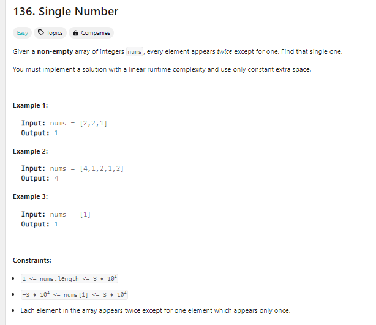
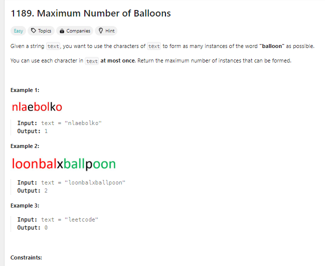
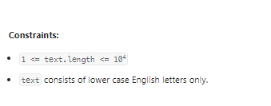
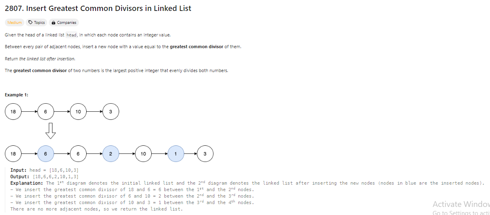

# LeetCode-Set001

<h1>LC1</h1>
<h4>Easy</h4>

<h1>LC136</h1>
<h4>Easy</h4>

<h1>LC230</h1>
<h4 style="color: yellow;">Medium</h4>

<h1>LC448</h1>
<h4 style="color: green;">Easy</h4>

<h1>LC496</h1>
<h4>Easy</h4>

<h1>LC1189</h1>
<h4>Easy</h4>

<h1>LC1207</h1>
<h4 style="color: green;">Easy</h4>
<!--  -->

<h1>LC2807</h1>
<h4 style="color: yellow;">Medium</h4>

